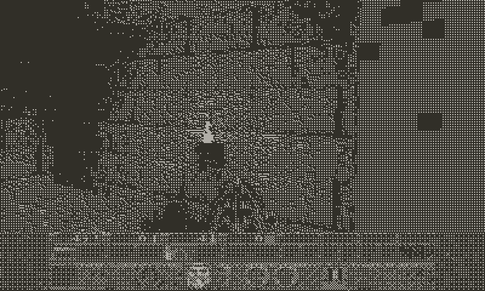

# Quake for Playdate

A WinQuake port for the [Playdate](https://play.date/), running on the device and in the Playdate Simulator.

Based on the original [Quake GPL source](https://github.com/id-Software/Quake), through [sysprog21/quake-embedded](https://github.com/sysprog21/quake-embedded).



*Demo 1 as the Playdate screen shows it. Captured on a computer from the port's own 1-bit display output (see [the last section](#checking-that-an-optimisation-does-not-change-the-picture)), not filmed on a device, so it says nothing about device speed.*

## Controls

| Input | In the game | In Quake's menus |
| --- | --- | --- |
| D-pad up / down | Walk forward / back | Move the cursor |
| D-pad left / right | Turn left / right (crank out: strafe) | Change the highlighted value |
| A | Fire | Select |
| B | Jump | Back |
| Crank | Turn left / right (clockwise = right) | - |

You run by default; the Options menu's "Always Run" turns that off. While the title-screen demo plays, A or B opens Quake's menu.

**Crank out.** Pulling the crank out of the body changes two things:

- The crank turns the view, so D-pad left / right strafe instead of turning.
- Autofire is active (below).

**Autofire.** With the crank out and "Autofire" on in the Options menu (it is on by default), the game holds fire for you while a live monster is in your line of fire: on the crosshair, or inside the range Quake's own auto-aim would turn toward. The axe only swings at what is within reach, and grenade and rocket launchers fire once every 2 seconds instead of being held. Hold A to fire yourself at any time.

**System menu** (the Playdate's menu button):

- **Game Menu** opens Quake's own menu (new game, save and load, Options).
- **Weapon** picks a weapon you own and have ammo for. It appears during play once you can choose between two or more. There is no weapon-cycling button, so this is how you switch.
- **Show FPS** toggles the frame-rate counter (on at launch).

## Building

Requires the [Playdate SDK](https://play.date/dev/) (`PLAYDATE_SDK_PATH` set) and, for the device, the Arm toolchain the SDK installs.

Game data is not included. Copy your `pak0.pak` (the freely distributable shareware one is fine) to
`port/boards/playdate/Source/id1/pak0.pak` before building, or into the game's Data folder at `id1/`.

```shell
git clone https://github.com/aliakseikalosha/quake-playdate && cd quake-playdate

# Simulator
mkdir build-sim && cd build-sim
cmake -DBOARD_NAME=playdate .. && make          # -> quake.pdx
cd ..

# Device
mkdir build-dev && cd build-dev
cmake -DCMAKE_TOOLCHAIN_FILE=../port/boards/playdate/toolchain.cmake -DBOARD_NAME=playdate .. && make
```

`-DPD_RENDER_WIDTH=400 -DPD_RENDER_HEIGHT=240` renders at full panel resolution (default 320x200, scaled, for speed).

Performance knobs (device build, pass to `cmake`):

- `-DPD_REFRESH_RATE=30` frames per second the system asks for (max 50, `0` = as fast as possible). Raise it if lighter scenes have headroom.
- `-DPD_OPT=-O3` optimisation level. Measured on a device: `-O2` is the same as `-O3` and `-Os` is no faster, so there is little to gain here; compare with "Show FPS" in the system menu.
- `-DPD_FAST_EDGES=ON` (default) array-based edge scan, about 6 ms per frame faster in the demos with identical output; it also keeps each surface's span list head on the stack while scanning. `OFF` uses the original linked-list version.
- `-DPD_FAST_ALIAS=ON` (default) alias models (monsters, weapon) are drawn with their per-triangle state in locals instead of ~50 globals plus a span buffer, with the two-buffer pixel stores split into separate runs, and their per-entity setup shares work (transform reused between the bbox check and the draw, `R_LightPoint` remembers where its trace landed for an exact origin). Identical output; `OFF` uses the original code.
- `-DPD_FAST_FACES=ON` (default) world faces keep their edge-emission scratch state and the traversal's bookkeeping (`edge_p`, `surface_p`, keys) on the stack, and world surface visibility is one bit per surface instead of a stamp in every `msurface_t`. Identical output; `OFF` uses the original code.
- `-DPD_FAST_SURFACES=ON` (default) surface cache bitmaps are built row by row (each row is one run of stores instead of sixteen 16-byte segments), and a surface that R_MarkLights flagged as dynamically lit but whose lightmap no light would actually change keeps its cache instead of being rebuilt (48% of the dynamic-light rebuilds in the demos; a rebuild would give the same texels). Identical output; `OFF` uses the original code.
- `-DPD_LOWRES_3D=ON` (default) renders the 3D view at half resolution; the display layer dithers it straight from the half-resolution buffer and only expands the rows that the console, menu or HUD text draw over.

## Settings

The Options menu keeps its settings (view size, brightness, volume, always run, autofire, **texture detail** ...) in `config.cfg` in the game's Data folder. It is written when you leave the Options menu and when the system pauses, locks or terminates the game, and read at the next launch. Key bindings are not saved (they come from `default.cfg` and the port's own button mapping).

Texture detail: `high` (default, `d_mipcap 0`) or `low` (`d_mipcap 1`, the sharpest mip level is never used; about 1.6 ms per frame faster in the demos, about 3%, with visibly softer textures).

## Profiling on the device

`-DPD_PROFILE=ON` builds an on-device profiler (nothing is compiled in otherwise): per-frame section timings and counters go to `prof.csv` in the game's Data folder. Add `-DPD_BENCH=ON` to play the demos back with `timedemo` (every demo frame is rendered, so builds can be compared frame for frame; `-DPD_BENCH_COUNT=1` plays only demo1, `-DPD_BENCH_CMDS="d_mipcap 1"` runs console commands first) and `-DPD_PROFILE_FINE=ON` for more detailed sections (adds about 2 ms per frame of timer overhead).

```shell
cmake -DCMAKE_TOOLCHAIN_FILE=../port/boards/playdate/toolchain.cmake -DBOARD_NAME=playdate \
      -DPD_PROFILE=ON -DPD_BENCH=ON -DPD_BENCH_COUNT=1 .. && make
scripts/pd-bench.sh build-prof demo1 105        # installs quake_PROF.pdx, runs, fetches bench-results/demo1.csv
scripts/pd-report.py bench-results/demo1.csv [other.csv]
```

The device sleeps after a few minutes and disconnects USB, so keep runs short or set Auto-lock to Never.

What the measurements showed about this hardware (useful when optimising):

- The heap, `.bss` and code live in slow memory behind a write-through data cache of about 16 KB: every byte stored costs about 26 ns (a 32-bit store to a global about 100 ns) and every cache line that misses about 1 us. The stack is fast internal RAM (a store is about 14 ns), but the game task's stack is only about 10 KB.
- So frame time is set by how many bytes are written to global memory and how many cache lines are touched, not by instruction counts. Keep hot scratch state in locals, avoid rewriting large buffers, and prefer compact, contiguous data.
- Static data layout alone moves a section by 2 ms or so, so compare builds only with identical instrumentation. The `PD_PROFILE_FINE` timers are cold-call expensive and distorted some sections by up to 3 ms, so confirm a result with the coarse profiler (or the "game says: N frames, T seconds" line) before believing it. The same binary run twice agrees to within ~0.3 ms, so differences between builds are layout, not noise.
- Scattered stores are the expensive kind: a store to a line that is not being streamed costs 0.4-0.9 us even when it hits the cache, while a run of adjacent stores costs ~26 ns/byte. Alternating stores between two buffers (view byte, then z halfword, per pixel) costs about twice as much as writing each buffer in its own run. Keep scratch state in locals, write outputs in ascending order into one line at a time.
- Independent cache misses do not overlap each other (four loads in flight take four times one miss), and there is no prefetch, but an early load does overlap with ALU work. A store to an uncached line does not allocate it, so data written and then read back soon after misses.
- `sinf`/`cosf` ~1 us, `sqrtf` ~0.7 us, `floorf` ~0.5 us, any `double` mul/div ~2-5 us and `sqrt(double)` 6.5 us (software floating point).
- Cost of a store run is per 32-byte line touched (~0.7 us), almost regardless of how many bytes it writes: whole rows cost 24 ns/byte, 16-byte segments at a row stride 41-49, an unaligned 18-byte span ~76 (1.4 us per span).
- An early load (a "prefetch by touch") overlaps with ALU work (~73% of a ~1.75 us miss hidden) and with stores (~78%), but not with loads, even cache hits (~1% hidden), so it only helps ahead of load-free work such as FP set-up.
- Surface cache: 73% of the builds in demo1 were dynamic-light rebuilds (muzzle flashes, projectiles), the rest first-time builds of newly visible surfaces; light styles and animated textures are negligible. The cache never thrashes (693 KB, ~4 MB of hunk is free). `d_mipcap 1` (coarser textures, changes the picture) is worth ~1.6 ms of scan: it is the "Texture detail" row of the Options menu (high by default).
- The deepest stack use was the world traversal recursion (~5 KB below the frame entry); the probes (`PROF_STK`, logged as `STK` lines) show it, and the whole scan chain is ~2.9 KB.

## Checking that an optimisation does not change the picture

`tools/hostcheck` runs the real engine and `display.c` on the host. `tools/hostcheck/run.sh` checks the low-res upscale invariants over scripted scenes (walking, console, menus, HUD, view sizes, demos); `HGOLD=file tools/hostcheck/run.sh` writes a hash of every LCD frame of the three demos plus a hash of the 8-bit render buffer and z buffer (`NO_FAST_ALIAS=1` / `NO_FAST_FACES=1` / `NO_FAST_SURFACES=1` build the original code paths, `EXTRA_DEFS="-DFOO=1"` adds compiler flags), and `tools/hostcheck/golden-compare.py a b` compares two such files (build a reference checkout with `TREE=/path OUT=ref NO_LAZY_CHECK=1` if it predates the lazy upscale). Needs clang and the Playdate SDK headers.

`HFRAMES=<prefix> tools/hostcheck/run.sh` plays a demo back in real time and writes what the LCD shows as `<prefix>-NNNN.pbm` pictures (`HDEMO` picks the demo, `HSKIP` the frames to skip, `HEVERY` the frames between pictures, default 2 = 15 per second, `HCOUNT` how many). `docs/demo.gif` was made from them:

```shell
mkdir -p /tmp/f && HFRAMES=/tmp/f/f HDEMO=1 HSKIP=200 HCOUNT=150 tools/hostcheck/run.sh
ffmpeg -framerate 15 -i /tmp/f/f-%04d.pbm -vf "format=rgb24,lutrgb=r='if(gt(val,127),177,49)':g='if(gt(val,127),174,47)':b='if(gt(val,127),167,40)',scale=800:480:flags=neighbor,split[a][b];[a]palettegen=stats_mode=full[p];[b][p]paletteuse=dither=none:diff_mode=rectangle" -loop 0 docs/demo.gif
```
